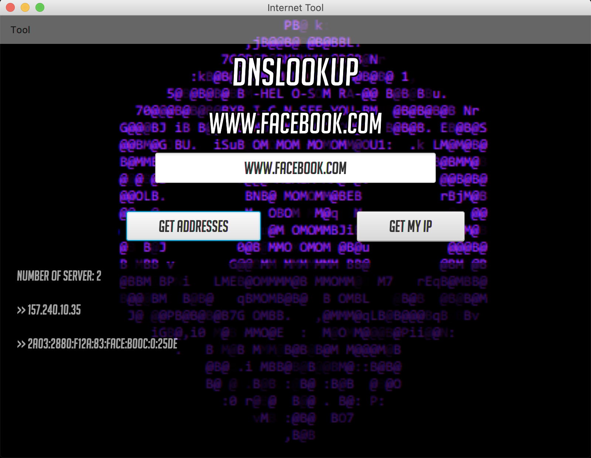
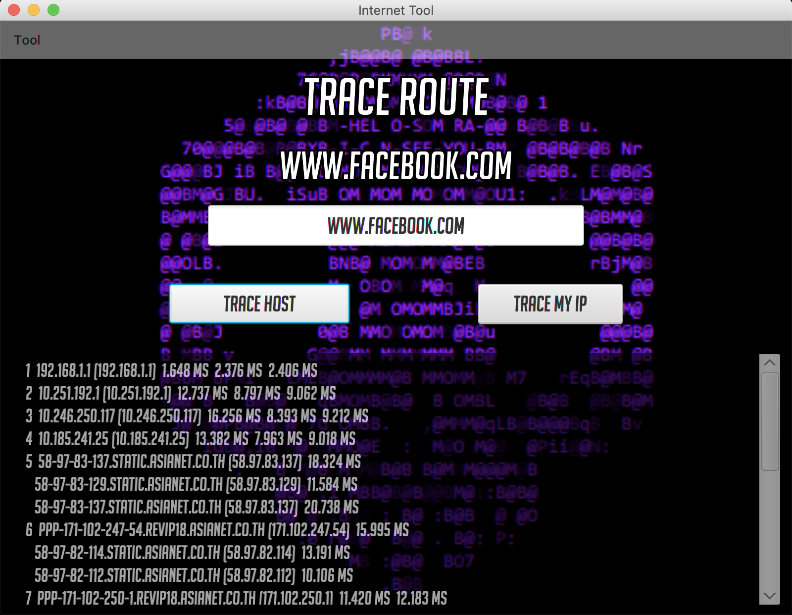

# Data Communication Project: DNSLookup Application

### This application will provide a service that can check the domain name system on the specific URL. User can also check their own IP address via this program. It can also checks the route packets across an IP network helping you understand your connections to a given server.

#### Checking the domain name system.
  
#### Checking route packets
  

## Group Members  
|         Animals        |     ID     |
|:----------------------:|:----------:|
| Pasut Kittiprapas      | 5910546431 |
| Theeruth Borisuth      | 5910545701 |
| Poorin Pitchayamongkol | 5910545809 |
